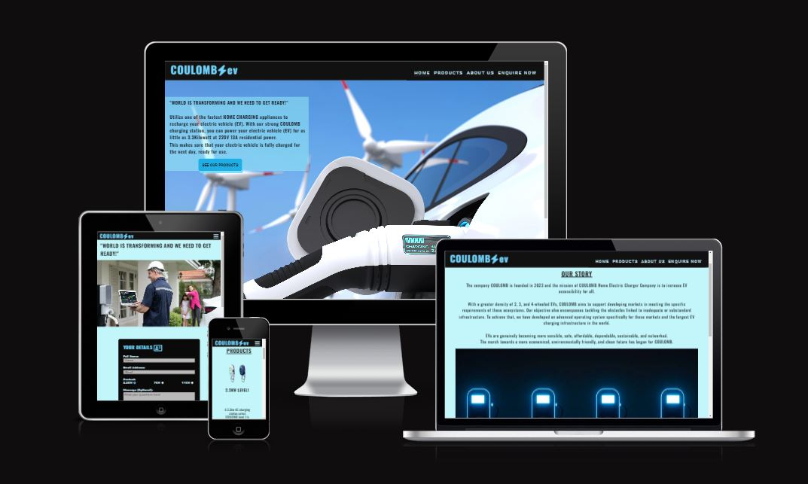

# COULOMB  ev

# Table Of Contents

- [Coulomb](#portfolio1-project-coulomb-p1)
- [Introduction](#introduction)
- [User Experience (UX)](#user-experience-ux)
- [Features](#features)
  * [Existing Features](#existing-features)
    + [Navigation Bar](#navigation-bar)
    + [Footer](#footer)
    + [Hero Image](#hero-image)
    + [Home Page](#home-page)
    + [About Us Page](#aboutus-page)
    + [Products](#products-page)
    + [Enquire Now](#enquire-now)
    + [Thank You](#thankyou-page)
  * [Future Features](#future-features)
- [Design](#design)
  * [Wireframes](#wireframes)
  * [Fonts](#fonts)
  * [Colours](#colours)
  * [Images](#images)
  * [Text](#text)
- [Languages](#languages)
- [Technologies Used](#technologies-used)
- [Testing](#testing)
  * [Validation](#validation)
  * [Responsiveness](#responsiveness)
  * [User Stories Testing](#user-stories-testing)
  * [Manual Testing](#manual-testing)
- [Deployment](#deployment)
-  [Bugs](#bugs)
- [Unfixed Bugs](#unfixed-bugs)
- [Credits](#credits)

