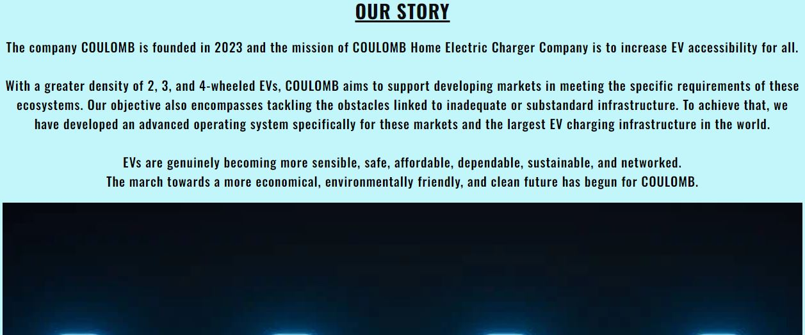

# <h1 align="center">COULOMB  ev</h1>

[view the live project HERE](https://swathikeshavamurthy.github.io/Coulomb-P1/)

# Table of Contents
- [COULOMB  ev](#coulomb--ev)
- [Table of Contents](#table-of-contents)
- [Introduction](#introduction)
- [User Goals and Stories (UX)](#user-goals-and-stories-ux)
  - [Website Owner Goals](#website-owner-goals)
  - [User Goals](#user-goals)
  - [User Stories](#user-stories)
    - [As a company owner](#as-a-company-owner)
    - [As a general user](#as-a-general-user)
    - [As a new user I want to](#as-a-new-user-i-want-to)
- [Design of the website](#design-of-the-website)
  - [Wireframes](#wireframes)
    - [Home Page Wireframes](#home-page-wireframes)
    - [AboutUs page Wireframes](#aboutus-page-wireframes)
    - [Products Page Wireframes](#products-page-wireframes)
    - [EnquireNow Page Wireframes](#enquirenow-page-wireframes)
    - [ThankYou Page Wireframes](#thankyou-page-wireframes)
  - [Fonts](#fonts)
  - [Color Scheme and Colors](#color-scheme-and-colors)
  - [Images](#images)
  - [Icons](#icons)
  - [Text](#text)
- [Features](#features)
  - [Existing Features](#existing-features)
    - [Navigation Bar](#navigation-bar)
    - [Footer](#footer)
    - [Hero Image](#hero-image)
    - [Home Page](#home-page)
    - [About Us Page](#about-us-page)
    - [Products](#products)
    - [Enquire Now](#enquire-now)
    - [Thank You](#thank-you)
  - [Future Features](#future-features)
- [Languages Used](#languages-used)
- [Technologies Used](#technologies-used)
- [Testing](#testing)
  - [Validation](#validation)
    - [HTML Validator](#html-validator)
    - [CSS Validator](#css-validator)
    - [Lighthouse in Chrome Developer Tools](#lighthouse-in-chrome-developer-tools)
  - [Responsiveness and Browser Compatibility](#responsiveness-and-browser-compatibility)
  - [User Stories Testing](#user-stories-testing)
  - [Manual Testing](#manual-testing)
- [Deployment](#deployment)
  - [The way this website was set up](#the-way-this-website-was-set-up)
- [Bugs](#bugs)
  - [Known Bugs](#known-bugs)
- [Credits](#credits)
  - [Code](#code)
  - [Media](#media)
  - [Others](#others)
  - [Acknowledgments](#acknowledgments)

# Introduction

This is a website for COULOMB ev, a fictional new Electric Chargers for Electric Vehicles exclusively designed for home.
It is one of the fastest HOME CHARGING appliances to recharge your electric vehicle . With our strong COULOMB charging station, you can power your electric vehicle for as little as 3.5Kilowatt at230V 16A residential power.This makes sure that your electric vehicle is fully charged for the next day, ready for use.

The website which specialises the purpose of the website is to establish an online presence for the company as the main source of information for customers about the line-of-work.
The website targets people who want to get some information about Electric chargers for Electric Vehicles and purchase.  The website showcases the products available to the user and provides the information necessary to make a purchase from the company.

# User Goals and Stories (UX)

## Website Owner Goals

As the website owner and owner of the company I want

- to provide concise, readable information about the products being offered, including specifications and cost
- to entice clients to visit the business website in order to make purchases and provide them with the option to place an online order and inquire about the products.
- to give background information on the reasons these products are affordable, portable, special, economical, and user-friendly.

## User Goals

As a user I want to

- move around the website simply and rightly.
- simply click to return to the home screen from any page.
- have access to the website and be able to read all content on screens of all sizes.

## User Stories

### As a company owner

As the website and company owner I want to

- develop an internet presence for our business.
- increase the number of local customers we serve - educate actual and potential and about our products, location, and company hours.
- to give customers a way to get in touch with us so they can ask questions or make enquiries about the products.
- to give some background information regarding the company website.

### As a general user

- find out the location, opening hours and contact information.
- information and uses of the products.
- view all the products and relevant information about each item.
  
### As a new user I want to

- find out what is different about the company products compared to others.
- details of company offers like products details with visual experience, services and warranty.
  
# Design of the website

To help users find what they're looking for quickly and precisely without having to scroll through a ton of content, the website is divided into four distinct pages.

Information about the products and the uses are the site's top priorities. Additionally, through links with clear labels, the user can access the products and enquire page.

Along with this a Thank you page will open after submitting in the enquire form.

Users can enquire about the products and get installed  using the form on the enquire now page.

The company's motto is to "increase Electric Vehicles (EV) chargers accessibility to all at very cheap and quality product".
The layout is kept uncomplicated and tidy and has been used minimalist colour scheme and design.

## Wireframes

Here are the first wireframes from the design stage. Every design element was put into practice with the help of [Balsamiq Wireframes](https://balsamiq.com/wireframes/)

### Home Page Wireframes

  

### AboutUs page Wireframes

  

### Products Page Wireframes

  

### EnquireNow Page Wireframes

  

### ThankYou Page Wireframes

  

## Fonts

[Google Fonts](https://fonts.google.com/) were used to import the fonts. Fonts chosen were Roboto for the headings/logo and Oswald for the body. Sans Serif was chosen as the backup font.

## Color Scheme and Colors

Color #71d4fc (Lightblue) was chosen for the font color as it attracts the users eyes and then BLACK color for the main content.

The colour theme is based around the colour of the company logo (COULOMB  ev)  which is lightblue color #71d4fc. Then shades of lightblue color has been used for the buttons and navigation bar. And grey color for margins and enquire form textbox background color.

## Images

Images were downloaded from Pexels, Unsplash and istock, and resized for the purpose of this website. The owners are credited in the Credits section.

## Icons

Icons were taken from Fontawesome website [Fontawesome](https://fontawesome.com/) and resized using [Favicon.io](https://favicon.io/).

## Text

Most of the text is written  by the author.
Some text is taken from Google and is rephrased by the author.

# Features

## Existing Features

### Navigation Bar

- The navigation bar is visible on all pages.
- The company logo is located on the left side of the navigation bar, and as the user would expect, it links to the home page from every page on the website.
- To let users know where they are on the website, the page link highlights when the page is active.

### Footer

- The footer is visible on all pages so that social media and download app links are always available to the user.
- The left side has the 5-social media links lined in a horizontal row.
- The right side are 2-links for app-download.
- Below all these there is a disclaimer for copyright.

### Hero Image

- Home page features a hero image with text overlay and link for Products page.
- The same Hero image is also visible on the Thankyou page.

  
### Home Page

- The hero image on the landing page has a brilliant, magnificent appearance to draw in users as soon as they land on the website. -
- In order to elicit a favorable emotional response and motivate the user to stay on the website, the hero image also includes the name of the company and a slogan.
- This page provides a brief overview of the company.

### About Us Page

- A slogan at the start of the page.

- There are two sections on the "About" page. The first contains an introduction and general company history information.
 Short paragraphs and concise information are used throughout.

- It has an image to catch users' attention.
- Additionally, the uses of the company's developed products are covered in the second section. For this reason, the COULOMB company outperforms all others.
  

### Products

- A slogan at the start of the page.
- Three products are available on the Products page in a row with images, that collapses to one column at the size of a mobile phone screen.

- Additionally, the page has a direct "Enquire Now" link that takes users to the form where they can fill out a request for more information about the products.

### Enquire Now

- A slogan and image at the start of the page.

- The Enquire Now page has 2 section, 1st section features a form for the user to full name, email address, products field set with 3 radio button options and a message (optional) with a submit button at the end.

- 2nd section contains the Contact us details with company name, address, contact number and email. Below this there is iframe map for location.

### Thank You

- The hero image on the thankyou page has a brilliant, magnificent appearance to draw in users as soon as they land on the website.
- In order to elicit a favorable emotional response and motivate the user to stay on the website, the hero image also includes the name of the company and a slogan.
- This displays a message after submitting the enquire form.
- In addition, this page has a navigation bar that leads to all other pages and a footer section with links to social media and app downloads.

## Future Features

- A payment facility for users to order and pay for their product.
- Links to 24/7 customer service and direct installation.
- Electric charger parts replacements facility.
- Customer reviews page and company future products plans on a direct blog page.
- Checkbox to subscribe to a newsletter for information about events and offers as the business expands.

# Languages Used

- [HTML5](https://en.wikipedia.org/wiki/HTML5) (Hypertext Markup Language) or HTML, was used to design the basic website
- [CSS3](https://en.wikipedia.org/wiki/Cascading_Style_Sheets)
(Cascading Style Sheets) or CSS, was used to style the website and improve its user interface.

# Technologies Used

[Balsamiq](https://balsamiq.com/) was used to create the wireframes.

[Google Fonts](https://fonts.google.com) was used for the fonts: Roboto and Oswald.

[Fontawesome](https://fontawesome.com) was used for the social media icons, map link and the arrow back to top.

[Favicon](https://favicon.io/) was used to resize title icon for all devices.

[Google maps](https://www.google.com/maps) was used to provide a map link.

[Convert-to-webp](https://image.online-convert.com/convert-to-webp) was used to convert images to webp format.

[px-to-rem](https://nekocalc.com/px-to-rem-converter) was used to convert px to rem measuremenets.

[Resize-images](https://www.simpleimageresizer.com/resize/webp) was used to resize the images.

[Am I Responsive](https://ui.dev/amiresponsive) was used to get a responsive image for README.

# Testing

## Validation

### HTML Validator

[HTML Validator](https://validator.w3.org/) was run at several points during the project and small syntax errors identified were fixed. At the final stage no errors were found. But a warning for Google Font imports was found.

- Home Page results

- About Us page results

- Products Page results

- Enquire Now Page results

- Thank You Page results

- Full Validation results are here

Home Page Results <a href="https://github.com/SwathiKeshavamurthy/Coulomb-P1/blob/main/documentation/validation-results/index.html%20Showing%20results%20for%20contents%20of%20text-input%20area%20-%20Nu%20Html%20Checker.pdf" target="_blank"> CLICK HERE </a>

Products Page Results <a href="https://github.com/SwathiKeshavamurthy/Coulomb-P1/blob/main/documentation/validation-results/products.html%20Showing%20results%20for%20contents%20of%20text-input%20area%20-%20Nu%20Html%20Checker.pdf" target="_blank"> CLICK HERE </a>

AboutUs Page Results <a href="https://github.com/SwathiKeshavamurthy/Coulomb-P1/blob/main/documentation/validation-results/aboutus.html%20Showing%20results%20for%20contents%20of%20text-input%20area%20-%20Nu%20Html%20Checker.pdf" target="_blank"> CLICK HERE </a>

EnquireNow Page Results <a href="https://github.com/SwathiKeshavamurthy/Coulomb-P1/blob/main/documentation/validation-results/enquirenow.html%20Showing%20results%20for%20contents%20of%20text-input%20area%20-%20Nu%20Html%20Checker.pdf" target="_blank"> CLICK HERE </a>

ThankYou Page Results <a href="https://github.com/SwathiKeshavamurthy/Coulomb-P1/blob/main/documentation/validation-results/thankyou.html%20Showing%20results%20for%20contents%20of%20text-input%20area%20-%20Nu%20Html%20Checker.pdf" target="_blank"> CLICK HERE </a>

### CSS Validator

 [CSS Validator](https://validator.w3.org/) was run several times during the project and small syntax errors like brackets closure which were corrected. At the time of submission the CSS code successfully passed the validator with no errors.

- Full Validation result is here

CSS- StyleSheet Page Result <a href="https://github.com/SwathiKeshavamurthy/Coulomb-P1/blob/main/documentation/validation-results/W3C%20CSS%20Validator%20results%20for%20TextArea%20(CSS%20level%203%20%2B%20SVG).pdf" target="_blank"> CLICK HERE </a>

### Lighthouse in Chrome Developer Tools

[Lighthouse in Chrome Developer Tools](https://en.wikipedia.org/wiki/Google_Lighthouse) was used to check performance.

## Responsiveness and Browser Compatibility

Browser tests on Chrome, Firefox, and Microsoft Edge revealed no issues with the website.

The website performed as expected across a wide range of screen sizes when tested on development tools on a variety of devices, including a Samsung S9, Nexus 10, Nest Hub, iPhone X , 2560px screens.
The design process made use of the Chrome development tools to verify breakpoints and responsiveness. Accordingly adjustments were made.

## User Stories Testing

These above features support the User Stories in the [User Goals and Stories (UX)](#user-goals-and-stories-ux) and [User Stories](#user-stories).

## Manual Testing

After verifying that each page's link worked, the form was successfully submitted to thankyou.html.

- Navigation bar- Menu links
- Footer- Social Media and Download App links
- See Our Products button on Home page
- Enquire Now button on Products page
- Form on Enquire Now page - 3 fields (Full Name, Email Address, Products) has be set required attribute. The form will not submit without the 3 fields being completed.
- Submit button on Enquire Now page takes to Thank You page
- Contact Us on Enqire Now page has Google Maps for location

All the above tests were tested manually on all screens.

# Deployment

## The way this website was set up

- Log in to [Github](https://github.com/)
- Open the Settings tab in the GitHub repository, then select Pages from the menu on the left.
- The page will automatically refresh with a detailed ribbon display to indicate the successful deployment.
- Any changes pushed to the master branch will take effect on the live project. - Choose the Master Branch from the drop-down menu in the source section.

  The live link is available at -[COULOMB  ev](https://swathikeshavamurthy.github.io/Coulomb-P1/index.html)
  
# Bugs
  
## Known Bugs

- The large images on every page were not zoomed to the best position on small screens.
- It was difficult to find good quality images of Electric Chargers. As EV's era has started now. Hence few images on larger screens look with low resolutions.
- I tried to center the Enquire (button) on Products page, but it didn't work. Even my mentor tried. 

# Credits

## Code

- Code for Google Maps: [hubspot](https://blog.hubspot.com/website/how-to-embed-google-map-in-html)
- Code for Unordered list to place side by side: [stackoverflow](https://stackoverflow.com/questions/6472178/two-unordered-list-side-by-side)
- Code for round buttons: [W3CSS](https://www.w3schools.com/howto/howto_css_round_buttons.asp)
  
## Media

- Images downloaded from [Pexels](https://www.pexels.com/), [Unsplash](https://unsplash.com/), [iStock](https://www.istockphoto.com)  and [Adobestock](https://stock.adobe.com/de/)

## Others

- Reference code and README formats from [Love Running](https://code-institute-solutions.github.io/love-running/).
- (:roots (section for colors in style.css)) I learned it from  [THRIVE Juices and Smoothies](https://github.com/elainebroche-dev/ms1-thrive/blob/master/assets/css/style.css) and try to implement it with help of [Using CSS Website](https://developer.mozilla.org/en-US/docs/Web/CSS/Using_CSS_custom_properties)
- Used [Google](https://www.google.com/) for website text.

## Acknowledgments

- I am grateful to my Code Institute mentor Jack Wachira for suggesting ThankYou page implementation and for his insightful counsel and constructive criticism regarding the project's planning and implementation. 
- Thanks to Kristyna, Cohort facilitator at Code Institute how gave infromation about README references and depth of the project timelines.